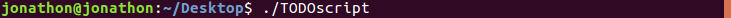
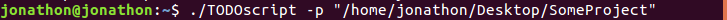

# TODOscript

## Abstract
Generate a TODO_t/ directory containing all of the TODOs and FIXMEs in the project folder. Each file in TODO_t/ contains
all the TODOs and FIXMEs for the subdirectory with the corresponding name. Invalid file types or those that do not contain
TODOs or FIXMEs will be ignored.

## Supported Flags
  **-p "PATH"**: Use the path defined by "PATH" as the root folder for the project. PATH must be an absolute path to the project
             folder and does **not** contain a trailing "/".  
  **No Flags**: If not flag is specified, the TODOscript will assume the directory it is in as the projects root folder.

## Usage
Navigate to the directory containing the TODOscript, and invoke the script by typing:
  
If the directory containing the TODOscript is not the project folder, either copy the TODOscript to the desired folder or type:  

where "/home/jonathon/Desktop/SomeProject" is the absolute path to the projects folder.
## Valid File Types
  All of the following file types are supported:  
  -C/C++  
  -Java  
  -BASH  
  -HTML  
  -CSS  
  -JS  
  -Python 

## Future Development
  1. Multi-line TODO/FIXME support
  2. Consecutive runs only parse files that have changed
